# AI-Image-Generation-Pipeline

## Description

AI Image Generation Pipeline: An automation solution for generating images using remote AI models. It reads prompts, generates images on a remote machine, transfers images to a storage server, and downloads them locally. Implemented with shell and PowerShell scripts, using SSH, SCP, and Rsync.

This project involves testing out an AI model that generates images, similar to midjourney. The infrastructure setup was not optimum due to a mix of shell and PowerShell scripts, and the need for SSH connections between different devices.

## Infrastructure

The infrastructure consists of a Windows PC for gaming, which runs the AI model, and an Ubuntu Server that is accessible via SSH from anywhere in the world, thanks to the OpenVPN Server it runs.

### Infrastructure Diagram

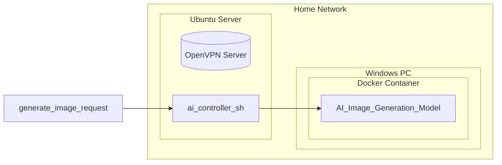
The Windows PC has an NVIDIA GPU and a powerful CPU, which allows it to run the AI model efficiently. The Docker container hosts the AI image generation model. The Ubuntu Server runs most of the scripts and can be accessed via SSH from anywhere in the world.

The project involves sending commands to the Docker instance running on the Windows machine and managing the image generation process remotely. This setup was created due to the constraints of the available hardware and network access.

## Usage
To use this project, follow the instructions in the individual script files and set up the required variables and configurations.

Make sure to have the appropriate dependencies and configurations for both the Windows PC and the Ubuntu Server to ensure seamless operation.

Contributing
Feel free to contribute to this project by submitting pull requests or opening issues for discussion. Please ensure that your contributions adhere to the existing coding style and infrastructure setup.

## Sample Images Generated from the pipeline

  
Click to expand and view sample images

  
  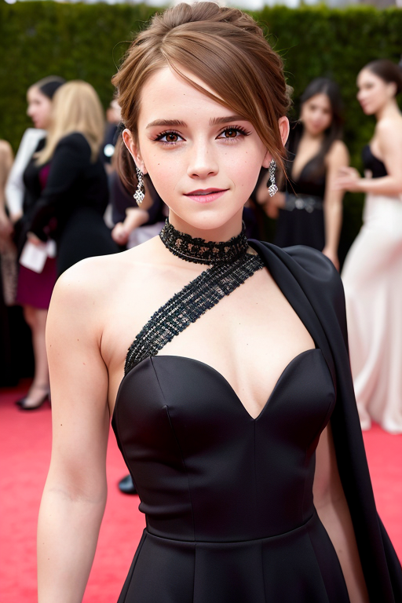
  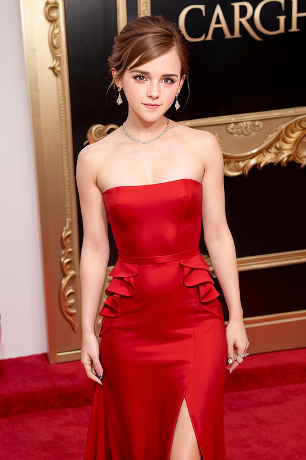
  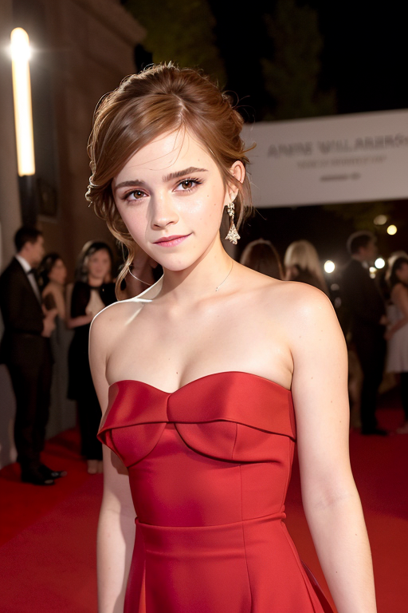
  
  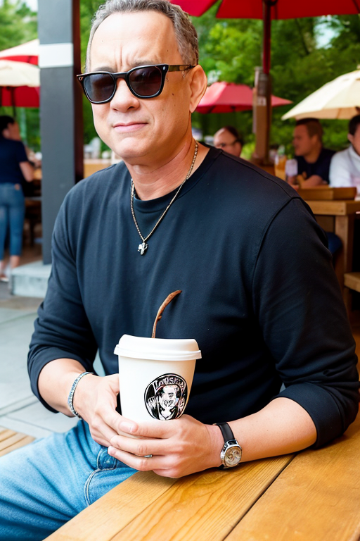
  
  
  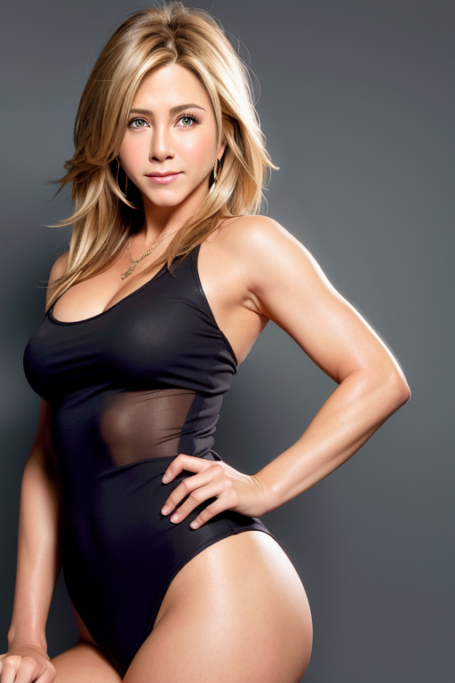
  
  
  
  
  
  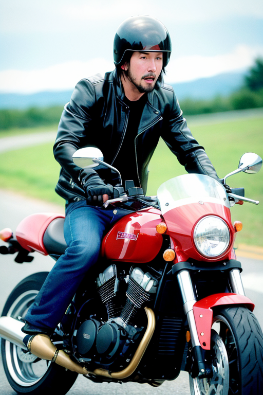
  
  
  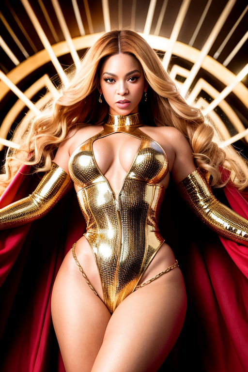
  
  
  
  
  
  
  
  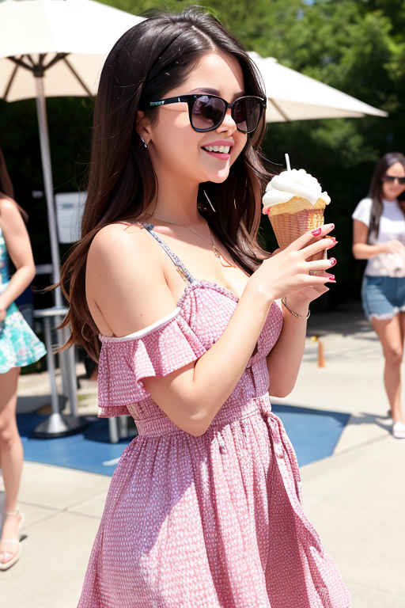
  
  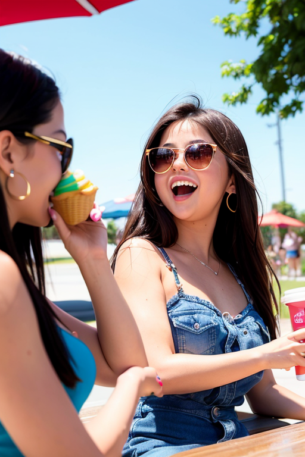
  
  
  
  
  
  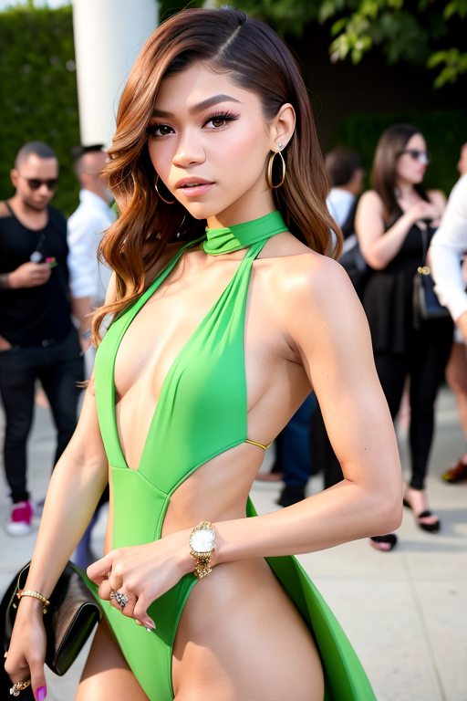
  
  
  
  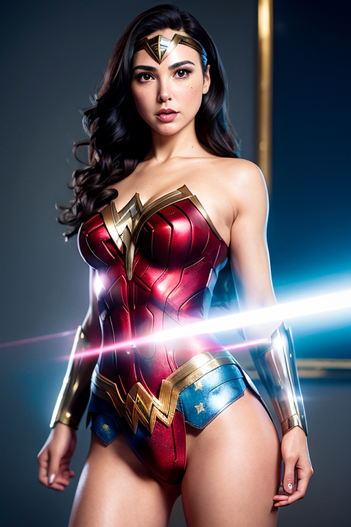
  
  
  

